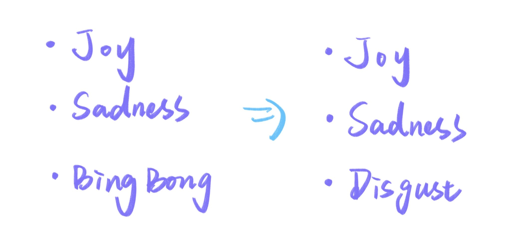
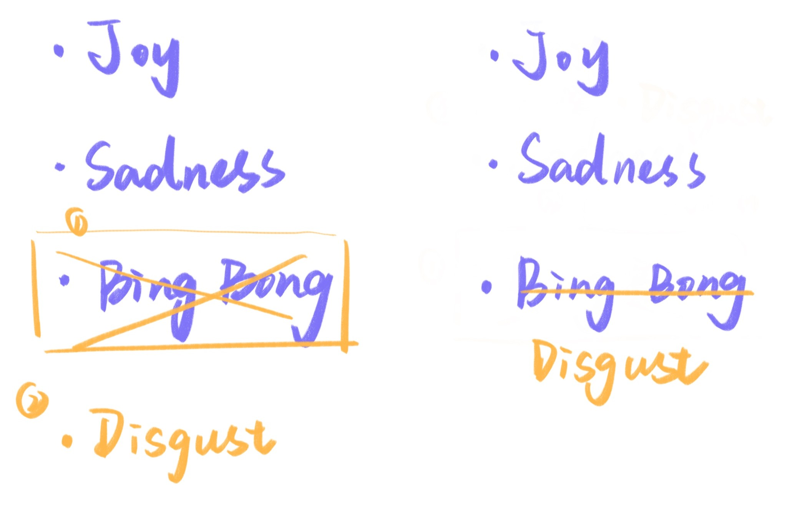
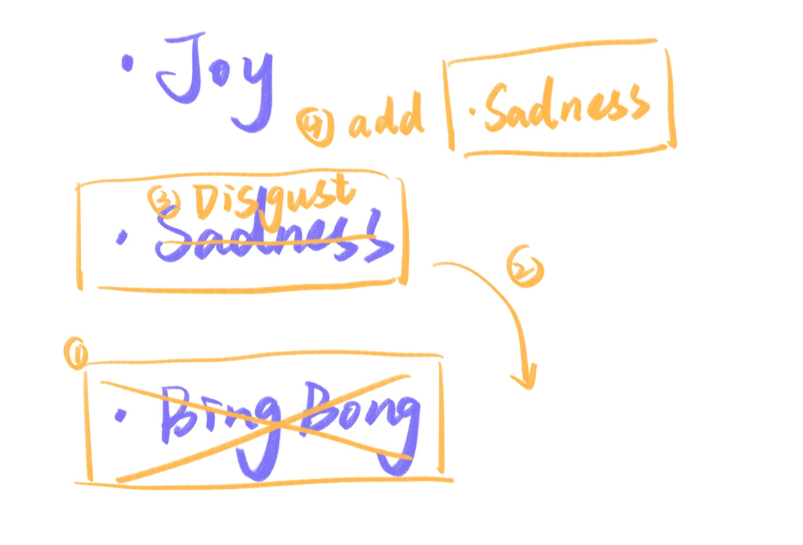

I’m currently taking Josh W. Comeau’s *The Joy of React* course, and it has been absolutely fantastic. He explains so many underlying principles and common pitfalls with such clarity—exactly the kind of guidance beginners and developers hoping to level up in React really need.

Starting today, I’ve decided to post one key concept I learned each day. I’ve just finished Module 2, which took me about three weeks. Even in that short time, I’ve accumulated around 80 notes in Obsidian (I use the Zettelkasten method).

I’ve been a developer for seven years and have learned countless technologies—Java, Python, C, vanilla JS, Vue, and many more—but I can’t confidently say I’ve mastered any of them. Honestly, I still feel like a beginner. I think it has a lot to do with mindset; I never found a sustainable way to keep learning and improving consistently. I’m hoping *The Joy of React* becomes a turning point for me, and I want this personal website to serve as a record of that ongoing process.

------

## 🌟 Today’s Key Concept: **Keys in React**

### What problem do keys solve?

React focuses on comparing the *before* and *after* states of components. When a single element contains multiple children, React has to figure out how to update them efficiently—and sometimes, without additional information, the interpretation can be ambiguous.

Imagine you have a list of your top three favorite characters from the movie *Inside Out*, and you decide to update the character in third place **(as shown in the illustration below)**. From React’s perspective, several interpretations are possible:



1. It might think it should delete the last `<li>` and create a brand new one with the content “Disgust” **(as shown on the left side of the image below)**.

2. It might think it should simply update the text content of the last `<li>` **(as shown on the right side of the image below)**.

   

3. Or it might think it should remove “Bing Bong”, move “Sadness” down into the third position, update its content to “Disgust”, and then create a new second item for “Sadness” **(as shown in the illustration below)**.



Some of these interpretations could cause unnecessary work or lead to unexpected behavior. This is why keys are important: **they help React identify each child reliably**, improving performance and preventing subtle bugs.

------

## Where do keys come from?

Usually, each item in your data set already has a unique `id`. If not, you need to generate one yourself. Developers commonly use `Math.random()` or `crypto.randomUUID()` (I’ll write more about this later).

------

## Where do keys go?

`key` is a special, reserved prop in React. Unlike regular props, it **does not appear inside `props`** on the React element. Instead, it sits alongside them:

```
{
  type: 'Character',
  key: "0.7432873483",
  props: { name: 'Sadness' }
}
```

------

## Key rules to follow

- Keys **must be unique** among siblings.
- They **should not change over time**, because React relies on them to track each element.
- They must be assigned at the **correct level**—directly on the element you're identifying. Placing them deeper in the tree won’t work.

------

## Things that *don’t* matter as much

- You don’t need keys on every element—only when a parent has multiple children.
- They only need to be unique **within the list** (among siblings on the same level).

