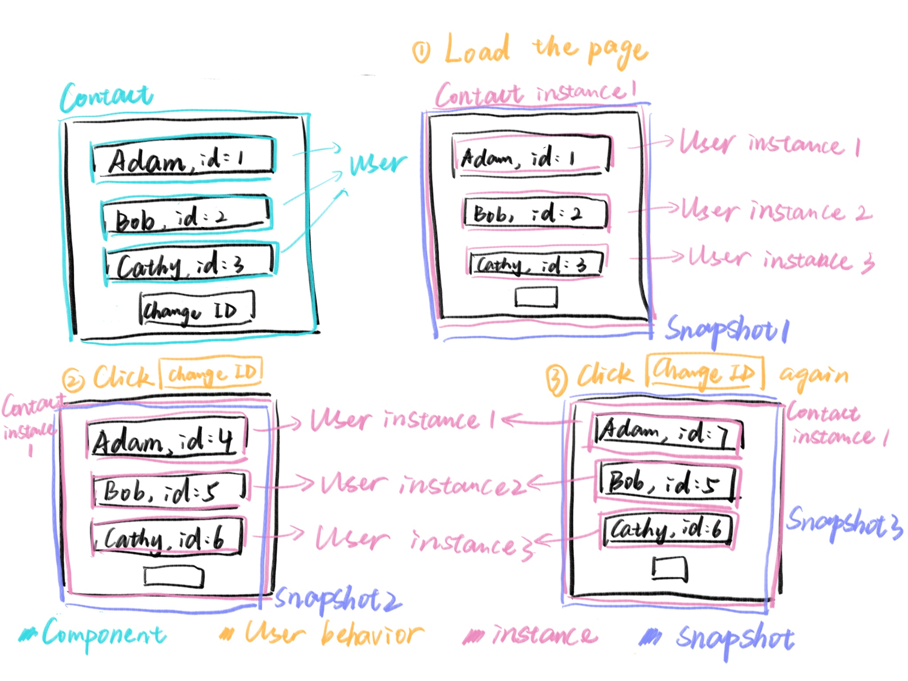

For React, rendering happens again and again over time and in response to user interactions, continuously producing new **snapshots**. We’re not just describing *what* should happen—we also need a place to store *memory*. And if that memory is not meant to be wiped out by every new render, it requires fairly complex logic.

React chooses to handle this complexity for us. It provides containers that can store long-term memory across renders. These containers are what we call **hooks**.

------

To be more concrete, imagine a `Contacts` component that renders the `User` component three times.

When the page loads for the first time, React inserts JavaScript objects into the DOM, creating **three `User` instances**. These instances are essentially three independent “copies” produced by the same `User` component. Each instance can behave differently depending on its own configuration, and changes inside one instance do not affect the others.

At this point, we have a **snapshot**—a representation of the current moment in time, including data, DOM nodes, and their relationships.

Now the user clicks the **Change ID** button.

Each `User` instance needs to update, but **they remain the same instances**—no new instances are created. However, because the data changes, React re-renders the UI. The newly rendered output, which again includes updated data and DOM nodes, forms a **new snapshot**.

If the user clicks **Change ID** again, yet another snapshot is produced—still without creating new instances.

### What React actually cares about

React doesn’t directly track whether data values have changed. Instead, it focuses on **reference changes**.

For example, when you call `setX()` to update some state, even if you pass in a value that looks identical to the previous one, a new memory reference may be created. Since the reference changes, React considers the state “updated” and triggers a re-render.